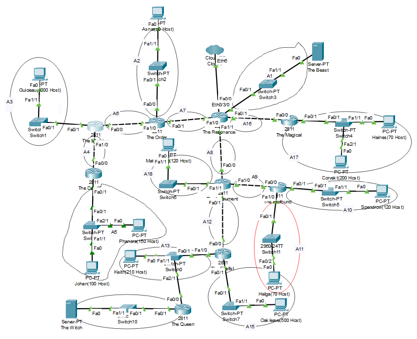
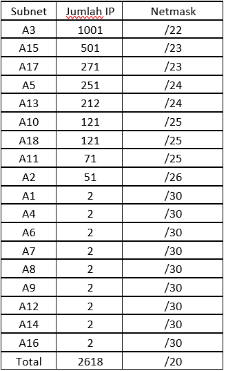
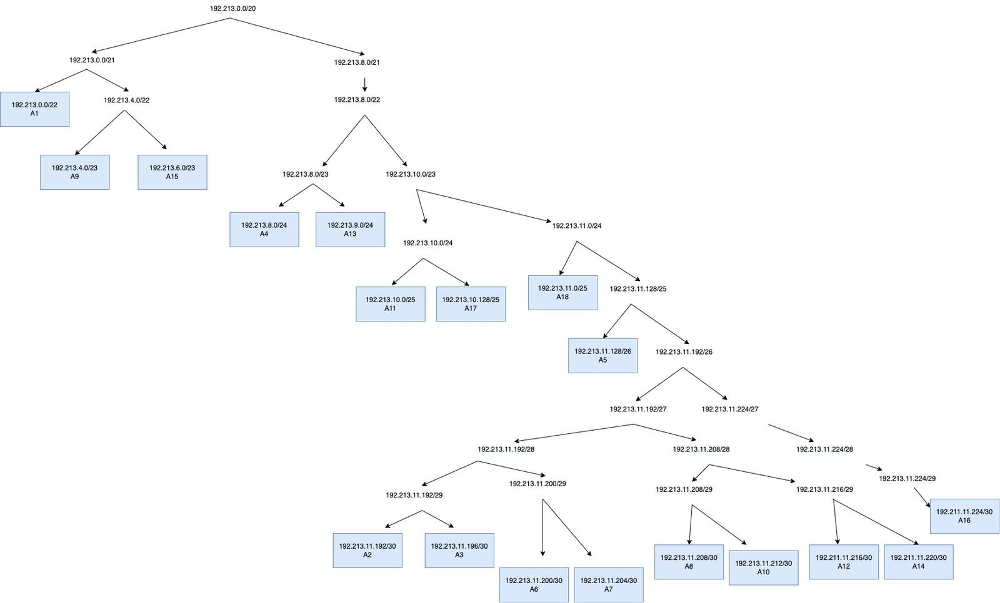
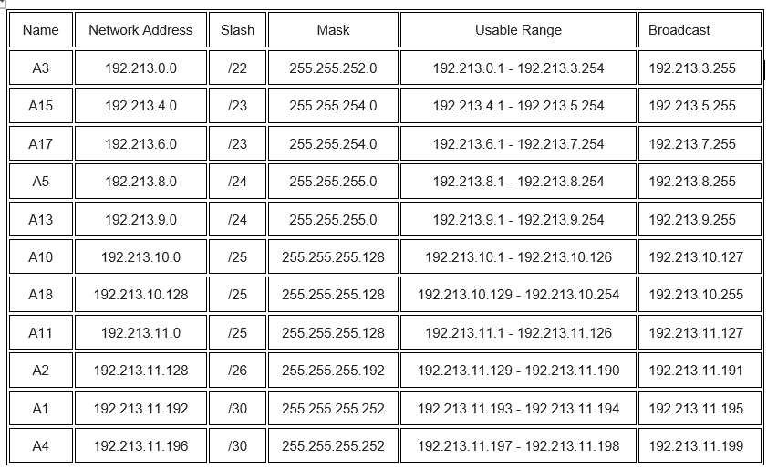
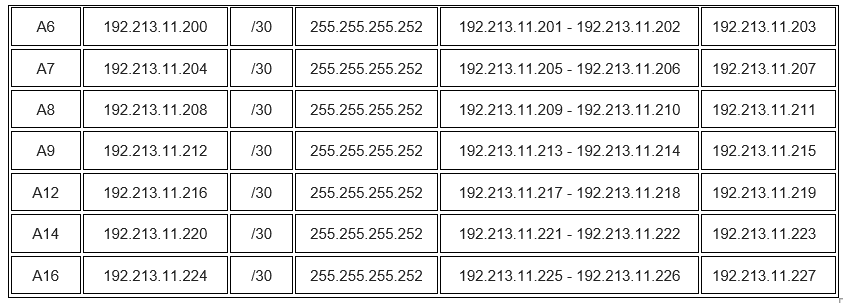

# Jarkom-Modul-4-ITA08-2022

Pengerjaan soal shift jarkom modul 4 oleh ITA08

# Anggota

| Nama                           | NRP          | 
| -------------------------------| -------------| 
| Axellino Anggoro A.              | `5027201040` | 
| Mutiara Nuraisyah Dinda R            | `5027201054` | 
| Brilianti Puspita S.  | `5027201070` |

# VLSM
## Pengelompokan Subnet


## Tabel Perhitungan Subnet


## VLSM Tree


## Tabel Network Address dan Broadcast Address



## Config Router dan Client
### Subnet A1
#### The Resonance -> The Beast (FA 0/0)
```
IP = 192.213.11.193 
SUBNET = 255.255.255.252
```
#### The Beast -> The Resonance (FA 0/1)
```
IP = 192.213.11.194
SUBNET = 255.255.255.252
```

### Subnet A2 
#### The Order -> Ashaf (FA0/0)
```
IP = 192.213.11.129
SUBNET = 255.255.255.192
```
#### Ashaf -> The Order (FA1/1)
```
IP = 192.213.11.130
SUBNET = 255.255.255.192
GATEWAY = 192.213.11.129
```

### Subnet A3
#### The Minister -> Guideau (FA0/1)
```
IP = 192.213.0.1 
SUBNET = 255.255.252.0
```
#### IPCONFIG Guideau -> The Minister
```
IP = 192.213.0.2
SUBNET = 255.255.252.0
GATEWAY = 192.213.0.1
```

### Subnet A4
#### The Minister -> The Dauntless (FA 1/0)
```
IP = 192.213.11.197 
SUBNET = 255.255.255.252
```
#### The Dauntless -> The Minister (FA 0/0)
```
IP = 192.213.11.198
SUBNET = 255.255.255.252
```

### Subnet A5
#### The Dauntless -> Phanora Johan (FA 0/1)
```
IP = 192.213.8.1 
SUBNET = 255.255.255.0
```
#### IPCONFIG Phanora -> The Dauntless
```
IP = 192.213.8.2 
SUBNET = 255.255.255.0
GATEWAY = 192.213.8.1 
```
#### IPCONFIG Johan -> The Dauntless
```
IP = 192.213.8.3 
SUBNET = 255.255.255.0
GATEWAY = 192.213.8.1
```

### Subnet A6
#### The Order -> The Minister (FA 1/0)
```
IP = 192.213.11.201 
SUBNET = 255.255.255.252
```
#### The Minister -> The Order (FA 0/0)
```
IP = 192.213.11.202 
SUBNET = 255.255.255.252
```

### Subnet A7
#### THE The Resonance -> The Order (FA 1/0)
```
IP = 192.213.11.205 
SUBNET = 255.255.255.252
```
#### The Order -> The Resonance (FA 0/1)
```
IP = 192.213.11.206
SUBNET = 255.255.255.252
```

### Subnet A8
#### The Resonance -> The Instrument (FA 1/1)
```
IP = 192.213.11.209 
SUBNET = 255.255.255.252
```
#### The Instrument -> The Resonance (FA 0/0)
```
IP = 192.213.11.210 
SUBNET = 255.255.255.252
```

### Subnet A9
#### The Instrument -> The Profound (FA 1/0)
```
IP = 192.213.11.213 
SUBNET = 255.255.255.252
```
#### The Profound -> The Instrument (FA  0/0)
```
IP = 192.213.11.214 
SUBNET = 255.255.255.252
```

### Subnet A10
#### The Profound -> Spendrow (FA 0/1)
```
IP = 192.213.10.1 
SUBNET = 255.255.255.128
```
#### IPCONFIG Spendrow -> The Profound
```
IP = 192.213.10.2 
SUBNET = 255.255.255.128
GATEWAY = 192.213.10.1 
```

### Subnet A11
####  The Profound -> Helga (FA 1/0)
```
IP = 192.213.11.1 
SUBNET = 255.255.255.128
```
#### IPCONFIG Helga -> The Profound
```
IP = 192.213.11.2 
SUBNET = 255.255.255.128
GATEWAY = 192.213.11.1
```

### Subnet A12
#### The Instrument -> The Firefist (FA 0/1)
```
IP = 192.213.11.217
SUBNET = 255.255.255.252
```
#### The Firefist -> The Instrument (FA 0/0)
```
IP = 192.213.11.218
SUBNET = 255.255.255.252
```

### Subnet A13
#### The Firefist -> Keith (FA 1/0)
```
IP = 192.213.9.1 
SUBNET = 255.255.255.0
```
#### IPCONFIG Keith -> The Firefist
```
IP = 192.213.9.2 
SUBNET = 255.255.255.0
GATEWAY = 192.213.9.1 
```

### Subnet A14
#### The Queen -> The Witch (FA 0/1)
```
IP = 192.213.11.221
SUBNET = 255.255.255.252
```
#### The Witch -> The Queen (FA 2/1)
```
IP = 192.213.11.222
SUBNET = 255.255.255.252
```

### Subnet A15
#### The Firefist -> Oakleave (FA0/1)
```
IP = 192.213.4.1
SUBNET = 255.255.254.0
```
#### IPCONFIG Oakleave -> The Firefist
```
IP = 192.213.4.2
SUBNET = 255.255.254.0
GATEWAY = 192.213.4.1
```
### Subnet A16
#### The Resonance -> The Magical (FA 0/1)
```
IP = 192.213.11.225 
SUBNET = 255.255.255.252
```
#### The Magical -> The Resonance (FA 0/0)
```
IP = 192.213.11.226 
SUBNET = 255.255.255.252
```

### Subnet A17
#### The Magical -> Haines Corvekt (FA0/1)
```
IP = 192.213.6.1
SUBNET = 255.255.254.0
```
#### IPCONFIG Haines -> The Magical
```
IP = 192.213.6.2
SUBNET = 255.255.254.0
GATEWAY = 192.213.6.1
```
#### IPCONFIG Corvekt -> The Magical
```
IP = 192.213.6.3
SUBNET = 255.255.254.0
GATEWAY = 192.213.6.1
```

### Subnet A18
#### The Instrument -> Matt Cugat (FA 1/1)
```
IP = 192.213.10.129 
SUBNET = 255.255.255.128
```
#### IPCONFIG Matt Cugat -> The Instrument
```
IP = 192.213.10.130 
SUBNET = 255.255.255.128
GATEWAY = 192.213.10.129 
```

## Routing
#### The Minister
```
192.213.8.0/24 via 192.213.11.198
192.213.11.204/30 via 192.213.11.201
192.213.11.224/30 via 192.213.11.201
```

#### The Order
```
0.0.0.0/0 via 192.213.11.205
192.213.0.0/22 via 192.213.11.202
192.213.11.196/30 via 192.213.11.202
192.213.8.0/24 via 192.213.11.202
```

#### The Resonance
```
192.213.11.128/26 via 192.213.11.206
192.213.0.0/30 via 192.213.11.200
192.213.0.0/22 via 192.213.11.206
192.213.11.196/30 via 192.213.11.206
192.213.8.0/24 via 192.213.11.206
192.213.10.128/25 via 192.213.11.210
192.213.11.216/30 via 192.213.11.210
192.213.9.0/24 via 192.213.11.210
192.213.11.220/30 via 192.213.11.210
192.213.4.0/23 via 192.213.11.210
192.213.11.212/30 via 192.213.11.210
192.213.11.0/25 via 192.213.11.210
192.213.10.0/25 via 192.213.11.210
192.213.6.0/23 via 192.213.11.226
192.213.11.200/30 via 192.213.11.206
```

#### The Magical
```
192.190.0.28/30 via 192.213.0.29
192.213.11.200/30 via 192.213.11.225
```

#### The Dauntless
```
0.0.0.0/0 via 192.213.0.5
0.0.0.0/0 via 192.213.11.197
```

#### The Instrument
```
0.0.0.0/0 via 192.213.0.17
192.213.9.0/24 via 192.213.0.14
192.213.0.8/30 via 192.213.0.14
192.213.2.0/23 via 192.213.0.14
192.213.8.128/25 via 192.213.0.58
192.213.8.0/25 via 192.213.0.58
0.0.0.0/0 via 192.213.11.209
192.213.9.0/24 via 192.213.11.218
192.213.11.220/30 via 192.213.11.218
192.213.4.0/23 via 192.213.11.218
192.213.11.0/25 via 192.213.11.214
192.213.10.0/25 via 192.213.11.214
192.213.9.0/24 via 192.213.11.209
```

#### The Profound
```
0.0.0.0/0 via 192.213.0.57
0.0.0.0/0 via 192.213.11.213
192.213.9.0/24 via 192.213.11.213
192.213.8.0/24 via 192.213.11.213
```

#### The Firefist
```
0.0.0.0/0 via 192.213.0.13
192.213.0.8/30 via 192.213.9.3
0.0.0.0/0 via 192.213.11.217
192.213.11.220/30 via 192.213.9.3
```

#### The Queen
```
0.0.0.0/0 via 192.213.9.1
```

## CIDR

## Kendala Pengerjaan