# Jarkom-Modul-4-ITA08-2022

Pengerjaan soal shift jarkom modul 4 oleh ITA08

# Anggota

| Nama                           | NRP          | 
| -------------------------------| -------------| 
| Axellino Anggoro A.              | `5027201040` | 
| Mutiara Nuraisyah Dinda R            | `5027201054` | 
| Brilianti Puspita S.  | `5027201070` |

# VLSM
## Pengelompokan Subnet


## Tabel Perhitungan Subnet


## VLSM Tree


## Tabel Network Address dan Broadcast Address


## Config Router dan Client
### Subnet A1
#### The Resonance -> The Beast (FA 0/0)
```
IP = 192.213.11.193 
SUBNET = 255.255.255.252
```
#### The Beast -> The Resonance (FA 0/1)
```
IP = 192.213.11.194
SUBNET = 255.255.255.252
```

### Subnet A2 
#### The Order -> Ashaf (FA0/0)
```
IP = 192.213.11.129
SUBNET = 255.255.255.192
```
#### Ashaf -> The Order (FA1/1)
```
IP = 192.213.11.130
SUBNET = 255.255.255.192
GATEWAY = 192.213.11.129
```

### Subnet A3
#### The Minister -> Guideau (FA0/1)
```
IP = 192.213.0.1 
SUBNET = 255.255.252.0
```
#### IPCONFIG Guideau -> The Minister
```
IP = 192.213.0.2
SUBNET = 255.255.252.0
GATEWAY = 192.213.0.1
```

### Subnet A4
#### The Minister -> The Dauntless (FA 1/0)
```
IP = 192.213.11.197 
SUBNET = 255.255.255.252
```
#### The Dauntless -> The Minister (FA 0/0)
```
IP = 192.213.11.198
SUBNET = 255.255.255.252
```

### Subnet A5
#### The Dauntless -> Phanora Johan (FA 0/1)
```
IP = 192.213.8.1 
SUBNET = 255.255.255.0
```
#### IPCONFIG Phanora -> The Dauntless
```
IP = 192.213.8.2 
SUBNET = 255.255.255.0
GATEWAY = 192.213.8.1 
```
#### IPCONFIG Johan -> The Dauntless
```
IP = 192.213.8.3 
SUBNET = 255.255.255.0
GATEWAY = 192.213.8.1
```

### Subnet A6
#### The Order -> The Minister (FA 1/0)
```
IP = 192.213.11.201 
SUBNET = 255.255.255.252
```
#### The Minister -> The Order (FA 0/0)
```
IP = 192.213.11.202 
SUBNET = 255.255.255.252
```

### Subnet A7
#### THE The Resonance -> The Order (FA 1/0)
```
IP = 192.213.11.205 
SUBNET = 255.255.255.252
```
#### The Order -> The Resonance (FA 0/1)
```
IP = 192.213.11.206
SUBNET = 255.255.255.252
```

### Subnet A8
#### The Resonance -> The Instrument (FA 1/1)
```
IP = 192.213.11.209 
SUBNET = 255.255.255.252
```
#### The Instrument -> The Resonance (FA 0/0)
```
IP = 192.213.11.210 
SUBNET = 255.255.255.252
```

### Subnet A9
#### The Instrument -> The Profound (FA 1/0)
```
IP = 192.213.11.213 
SUBNET = 255.255.255.252
```
#### The Profound -> The Instrument (FA  0/0)
```
IP = 192.213.11.214 
SUBNET = 255.255.255.252
```

### Subnet A10
#### The Profound -> Spendrow (FA 0/1)
```
IP = 192.213.10.1 
SUBNET = 255.255.255.128
```
#### IPCONFIG Spendrow -> The Profound
```
IP = 192.213.10.2 
SUBNET = 255.255.255.128
GATEWAY = 192.213.10.1 
```

### Subnet A11
####  The Profound -> Helga (FA 1/0)
```
IP = 192.213.11.1 
SUBNET = 255.255.255.128
```
#### IPCONFIG Helga -> The Profound
```
IP = 192.213.11.2 
SUBNET = 255.255.255.128
GATEWAY = 192.213.11.1
```

### Subnet A12
#### The Instrument -> The Firefist (FA 0/1)
```
IP = 192.213.11.217
SUBNET = 255.255.255.252
```
#### The Firefist -> The Instrument (FA 0/0)
```
IP = 192.213.11.218
SUBNET = 255.255.255.252
```

### Subnet A13
#### The Firefist -> Keith (FA 1/0)
```
IP = 192.213.9.1 
SUBNET = 255.255.255.0
```
#### IPCONFIG Keith -> The Firefist
```
IP = 192.213.9.2 
SUBNET = 255.255.255.0
GATEWAY = 192.213.9.1 
```

### Subnet A14
#### The Queen -> The Witch (FA 0/1)
```
IP = 192.213.11.221
SUBNET = 255.255.255.252
```
#### The Witch -> The Queen (FA 2/1)
```
IP = 192.213.11.222
SUBNET = 255.255.255.252
```

### Subnet A15
#### The Firefist -> Oakleave (FA0/1)
```
IP = 192.213.4.1
SUBNET = 255.255.254.0
```
#### IPCONFIG Oakleave -> The Firefist
```
IP = 192.213.4.2
SUBNET = 255.255.254.0
GATEWAY = 192.213.4.1
```
### Subnet A16
#### The Resonance -> The Magical (FA 0/1)
```
IP = 192.213.11.225 
SUBNET = 255.255.255.252
```
#### The Magical -> The Resonance (FA 0/0)
```
IP = 192.213.11.226 
SUBNET = 255.255.255.252
```

### Subnet A17
#### The Magical -> Haines Corvekt (FA0/1)
```
IP = 192.213.6.1
SUBNET = 255.255.254.0
```
#### IPCONFIG Haines -> The Magical
```
IP = 192.213.6.2
SUBNET = 255.255.254.0
GATEWAY = 192.213.6.1
```
#### IPCONFIG Corvekt -> The Magical
```
IP = 192.213.6.3
SUBNET = 255.255.254.0
GATEWAY = 192.213.6.1
```

### Subnet A18
#### The Instrument -> Matt Cugat (FA 1/1)
```
IP = 192.213.10.129 
SUBNET = 255.255.255.128
```
#### IPCONFIG Matt Cugat -> The Instrument
```
IP = 192.213.10.130 
SUBNET = 255.255.255.128
GATEWAY = 192.213.10.129 
```

## Routing
#### The Minister
```
192.213.8.0/24 via 192.213.11.198
192.213.11.204/30 via 192.213.11.201
192.213.11.224/30 via 192.213.11.201
```

#### The Order
```
0.0.0.0/0 via 192.213.11.205
192.213.0.0/22 via 192.213.11.202
192.213.11.196/30 via 192.213.11.202
192.213.8.0/24 via 192.213.11.202
```

#### The Resonance
```
192.213.11.128/26 via 192.213.11.206
192.213.0.0/30 via 192.213.11.200
192.213.0.0/22 via 192.213.11.206
192.213.11.196/30 via 192.213.11.206
192.213.8.0/24 via 192.213.11.206
192.213.10.128/25 via 192.213.11.210
192.213.11.216/30 via 192.213.11.210
192.213.9.0/24 via 192.213.11.210
192.213.11.220/30 via 192.213.11.210
192.213.4.0/23 via 192.213.11.210
192.213.11.212/30 via 192.213.11.210
192.213.11.0/25 via 192.213.11.210
192.213.10.0/25 via 192.213.11.210
192.213.6.0/23 via 192.213.11.226
192.213.11.200/30 via 192.213.11.206
```

#### The Magical
```
192.213.0.28/30 via 192.213.0.29
192.213.11.200/30 via 192.213.11.225
```

#### The Dauntless
```
0.0.0.0/0 via 192.213.0.5
0.0.0.0/0 via 192.213.11.197
```

#### The Instrument
```
0.0.0.0/0 via 192.213.0.17
192.213.9.0/24 via 192.213.0.14
192.213.0.8/30 via 192.213.0.14
192.213.2.0/23 via 192.213.0.14
192.213.8.128/25 via 192.213.0.58
192.213.8.0/25 via 192.213.0.58
0.0.0.0/0 via 192.213.11.209
192.213.9.0/24 via 192.213.11.218
192.213.11.220/30 via 192.213.11.218
192.213.4.0/23 via 192.213.11.218
192.213.11.0/25 via 192.213.11.214
192.213.10.0/25 via 192.213.11.214
192.213.9.0/24 via 192.213.11.209
```

#### The Profound
```
0.0.0.0/0 via 192.213.0.57
0.0.0.0/0 via 192.213.11.213
192.213.9.0/24 via 192.213.11.213
192.213.8.0/24 via 192.213.11.213
```

#### The Firefist
```
0.0.0.0/0 via 192.213.0.13
192.213.0.8/30 via 192.213.9.3
0.0.0.0/0 via 192.213.11.217
192.213.11.220/30 via 192.213.9.3
```

#### The Queen
```
0.0.0.0/0 via 192.213.9.1
```

## CIDR

### Pengelompokan Subnet

#### Subnet tingkat A

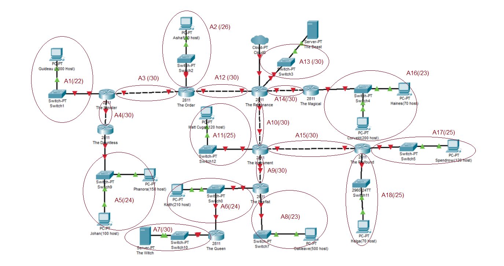

#### Subnet tingkat B

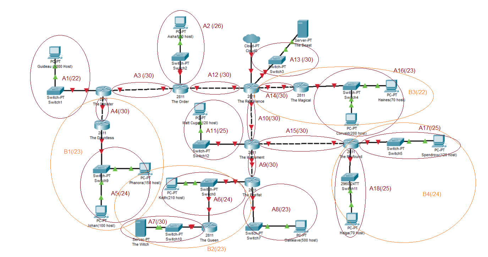

| Subnet Baru | Subnet Anggota 1 | Subnet Anggota 2 | Netmask |
| :---: | :---: | :---: | :---: |
| B1 | A5 (/24) | A4 (/30) | /23 |
| B2 | A7 (/30) | A6 (/24) | /23 |
| B3 | A14 (/30) | A16 (/23) | /22 |
| B4 | A18 (/25) | A17 (/25) | /24 |

#### Subnet tingkat C

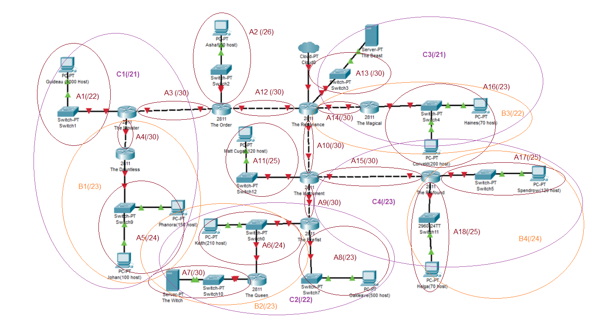

| Subnet Baru | Subnet Anggota 1 | Subnet Anggota 2 | Netmask |
| :---: | :---: | :---: | :---: |
| C1 | B1 (/23) | A1 (/22) | /21 |
| C2 | B2 (/23) | A8 (/23) | /22 |
| C3 | B3 (/22) | A13 (/30) | /21 |
| C4 | B4 (/24) | A15 (/30) | /23 |

#### Subnet tingkat D

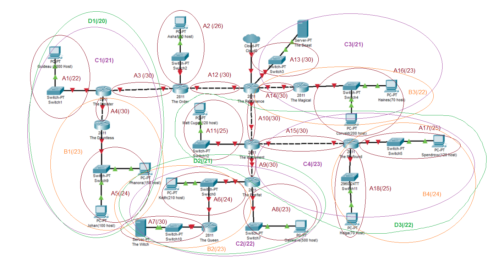

| Subnet Baru | Subnet Anggota 1 | Subnet Anggota 2 | Netmask |
| :---: | :---: | :---: | :---: |
| D1 | C1 (/21) | A3 (/30) | /20 |
| D2 | C2 (/22) | A9 (/30) | /21 |
| D3 | C4 (/23) | A11 (/25) | /22 |

#### Subnet tingkat E

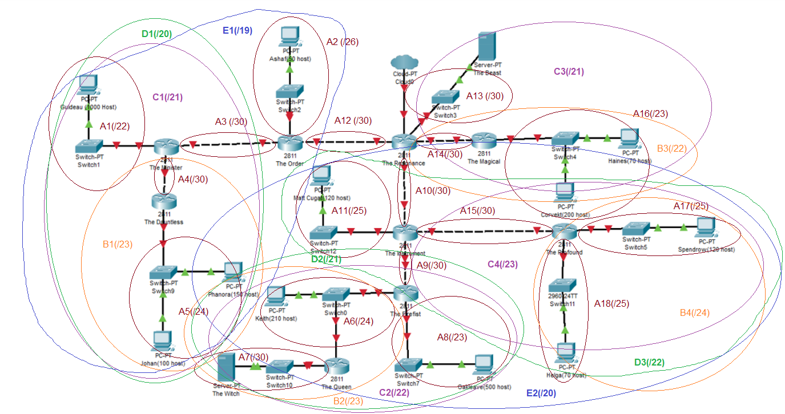

| Subnet Baru | Subnet Anggota 1| Subnet Anggota 2 | Netmask |
| :---: | :---: | :---: | :---: |
| E1 | D1 (/20) | A2 (/26) | /19 |
| E2 | D2 (/21) | D3 (/22) | /20 |

#### Subnet tingkat F

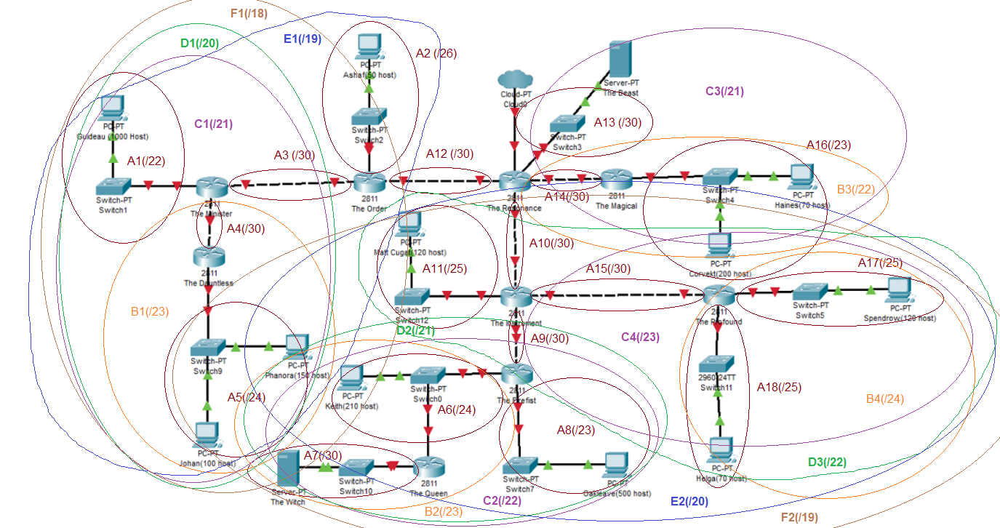

| Subnet Baru | Subnet Anggota 1 | Subnet Anggota 2 | Netmask |
| :---: | :---: | :---: | :---: |
| F1 | E1 (/19) | A12 (/30) | /18 |
| F2 | E2 (/20) | A10 (/30) | /19 |

#### Subnet tingkat G

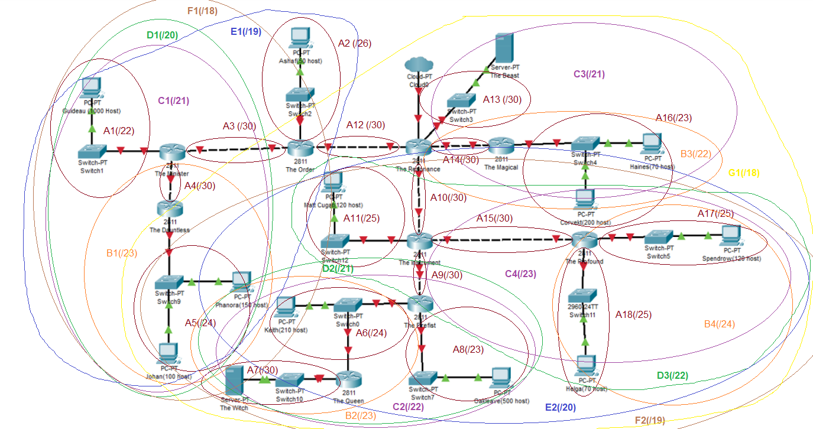

| Subnet Baru | Subnet Anggota 1 | Subnet Anggota 2 | Netmask |
| :---: | :---: | :---: | :---: |
| G1 | F2 (/19) | C3 (/21) | /18 |

#### Subnet tingkat H

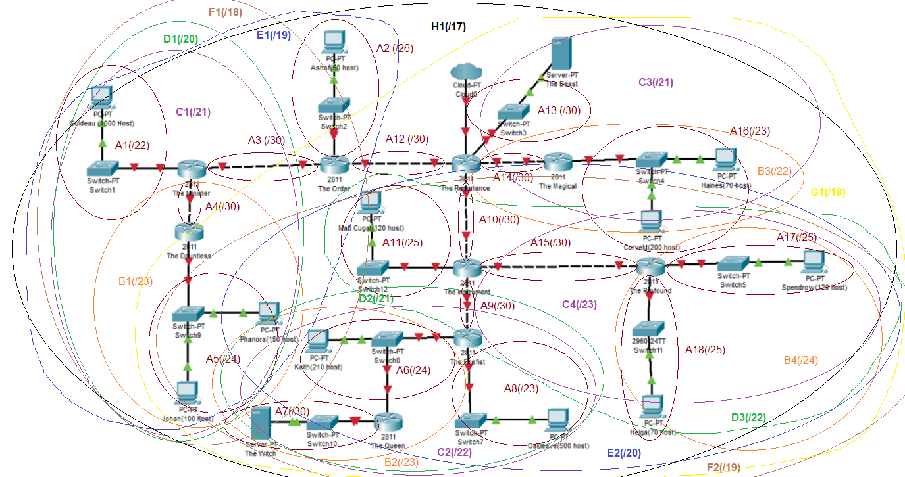

| Subnet Baru | Subnet Anggota 1 | Subnet Anggota 2 | Netmask |
| :---: | :---: | :---: | :---: |
| H1 | F1 (/18) | G1 (/18) | /17 |

## CIDR Tree

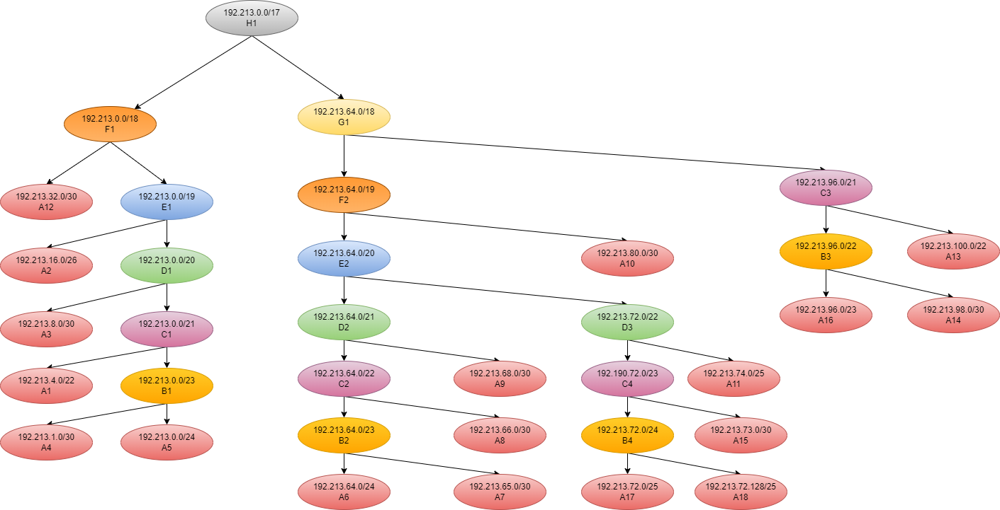

## Network Configuration

Setelah mendapatkan pembagian IP, dilakukan network configuration untuk setiap node yang ada

### Router
#### The Resonance

```
auto eth0
iface eth0 inet dhcp
auto eth1
iface eth1 inet static
    address 192.213.32.1
    netmask 255.255.255.252
auto eth2
iface eth2 inet static
    address 192.213.80.1
    netmask 255.255.255.252
auto eth3
iface eth3 inet static
    address 192.213.98.1
    netmask 255.255.255.252
auto eth4
iface eth4 inet static
    address 192.213.100.1
    netmask 255.255.255.252
```

#### The Order

```
auto eth0
iface eth0 inet static
    address 192.213.32.2
    netmask 255.255.255.252
    gateway 192.213.32.1
auto eth1
iface eth1 inet static
    address 192.213.16.1
    netmask 255.255.255.192
auto eth2
iface eth2 inet static
    address 192.213.8.1
    netmask 255.255.255.252
```

#### The Minister

```
auto eth0
iface eth0 inet static
    address 192.213.8.2
    netmask 255.255.255.252
    gateway 192.213.8.1
auto eth1
iface eth1 inet static
    address 192.213.4.1
    netmask 255.255.252.0
auto eth2
iface eth2 inet static
    address 192.213.1.1
    netmask 255.255.255.252
```
#### The Dauntless

```
auto eth0
iface eth0 inet static
    address 192.213.1.2
    netmask 255.255.255.252
    gateway  192.213.1.1
auto eth1
iface eth1 inet static
    address 192.213.0.1
    netmask 255.255.255.0
```

#### The Instrument

```
auto eth0
iface eth0 inet static
    address 192.213.80.2
    netmask 255.255.255.252
    gateway 192.213.80.1
auto eth1
iface eth1 inet static
    address 192.213.74.1
    netmask 255.255.255.128
auto eth2
iface eth2 inet static
    address 192.213.68.1
    netmask 255.255.255.252
auto eth3
iface eth3 inet static
    address 192.213.73.1
    netmask 255.255.255.252
```

#### The Firefist

```
auto eth0
iface eth0 inet static
    address 192.213.68.2
    netmask 255.255.255.252
    gateway 192.213.68.1
auto eth1
iface eth1 inet static
    address 192.213.64.1
    netmask 255.255.255.0
auto eth2
iface eth2 inet static
    address 192.213.66.1
    netmask 255.255.254.0
```
#### The Profound

```
auto eth0
iface eth0 inet static
    address 192.213.73.2
    netmask 255.255.255.252
    gateway 192.213.73.1
auto eth1
iface eth1 inet static
    address 192.213.72.129
    netmask 255.255.255.128
auto eth2
iface eth2 inet static
    address 192.213.72.1
    netmask 255.255.255.128
```
#### The Magical

```
auto eth0
iface eth0 inet static
    address 192.213.98.2
    netmask 255.255.255.252
    gateway 192.213.98.1
auto eth1
iface eth1 inet static
    address 192.213.96.1
    netmask 255.255.254.0
```

#### The Queen

```
auto eth0
iface eth0 inet static
    address 192.213.64.3
    netmask 255.255.255.0
    gateway 192.213.64.1
auto eth1
iface eth1 inet static
    address 192.213.65.1
    netmask 255.255.255.252
```

### Host
#### Guideau (1000 host)

```
auto eth0
iface eth0 inet static
    address 192.213.4.2
    netmask 255.255.255.0
    gateway 192.213.4.1
```

#### Ashaf (50 host)

```
auto eth0
iface eth0 inet static
    address 192.213.16.2
    netmask 255.255.255.192
    gateway 192.213.16.1
```

#### Johan (100 host)

```
auto eth0
iface eth0 inet static
    address 192.213.0.2
    netmask 255.255.255.0
    gateway 192.213.0.1
```

#### Phanora (150 host)

```
auto eth0
iface eth0 inet static
    address 192.213.0.3
    netmask 255.255.255.0
    gateway 192.213.0.1
```


#### Matt Cugat (120 host)

```
auto eth0
iface eth0 inet static
    address 192.213.74.2
    netmask 255.255.255.128
    gateway 192.213.74.1
```

#### Keith (210 host)

```
auto eth0
iface eth0 inet static
    address 192.213.64.2
    netmask 255.255.255.0
    gateway 192.213.64.1
```

#### Oakleave (500 host)

```
auto eth0
iface eth0 inet static
    address 192.213.66.2
    netmask 255.255.254.0
    gateway 192.213.66.1
```


#### Helga (70 host)

```
auto eth0
iface eth0 inet static
    address 192.213.72.130
    netmask 255.255.255.128
    gateway 192.213.72.129
```

#### Spendrow (120 host)

```
auto eth0
iface eth0 inet static
    address 192.213.72.2
    netmask 255.255.255.128
    gateway 192.213.72.1
```


#### Coverkt (200 host)

```
auto eth0
iface eth0 inet static
    address 192.213.96.2
    netmask 255.255.254.0
    gateway 192.213.96.1
```

#### Haines (70 host)

```
auto eth0
iface eth0 inet static
    address 192.213.96.3
    netmask 255.255.254.0
    gateway 192.213.96.1
```

### Server

#### The Witch

```
auto eth0
iface eth0 inet static
    address 192.213.65.2
    netmask 255.255.255.252
    gateway 192.213.65.1
```


#### The Beast

```
auto eth0
iface eth0 inet static
    address 192.213.100.2
    netmask 255.255.255.252
    gateway 192.213.100.1
```

## Routing

Sesudah melakukan network configuration, kita perlu melakukan routing pada setiap router dan memasukkan nameserver pada setiap host dan router dengan scrip yang disimpan pada root, disini kami menyimpan tiap konfigurasi pada ```.bashrc``` di root.

### Router
#### The Resonance

```
iptables -t nat -A POSTROUTING -o eth0 -j MASQUERADE -s 192.213.0.0/16

route add -net 192.213.16.0 netmask 255.255.255.192 gw 192.213.32.2
route add -net 192.213.8.0 netmask 255.255.255.252 gw 192.213.32.2
route add -net 192.213.4.0 netmask 255.255.252.0 gw 192.213.32.2
route add -net 192.213.1.0 netmask 255.255.255.252 gw 192.213.32.2
route add -net 192.213.0.0 netmask 255.255.255.0 gw 192.213.32.2
route add -net 192.213.74.0 netmask 255.255.255.128 gw 192.213.80.2
route add -net 192.213.68.0 netmask 255.255.255.252 gw 192.213.80.2
route add -net 192.213.64.0 netmask 255.255.255.0 gw 192.213.80.2
route add -net 192.213.65.0 netmask 255.255.255.252 gw 192.213.80.2
route add -net 192.213.66.0 netmask 255.255.254.0 gw 192.213.80.2
route add -net 192.213.73.0 netmask 255.255.255.252 gw 192.213.80.2
route add -net 192.213.72.128 netmask 255.255.255.128 gw 192.213.80.2
route add -net 192.213.72.0 netmask 255.255.255.128 gw 192.213.80.2
route add -net 192.213.96.0 netmask 255.255.254.0 gw 192.213.98.2

```

#### The Order

```
echo nameserver 192.168.122.1 > /etc/resolv.conf
iptables -t nat -A POSTROUTING -o eth0 -j MASQUERADE -s 192.213.0.0/16

route add -net 0.0.0.0 netmask 0.0.0.0 gw 192.213.32.1
route add -net 192.213.4.0 netmask 255.255.252.0 gw 192.213.8.2
route add -net 192.213.0.0 netmask 255.255.255.0 gw 192.213.8.2
route add -net 192.213.1.0 netmask 255.255.255.252 gw 192.213.8.2
```

#### The Minister

```
echo nameserver 192.168.122.1 > /etc/resolv.conf
iptables -t nat -A POSTROUTING -o eth0 -j MASQUERADE -s 192.213.0.0/16

route add -net 0.0.0.0 netmask 0.0.0.0 gw 192.213.8.1
route add -net 192.213.0.0 netmask 255.255.255.0 gw 192.213.1.2
```

#### The Dauntless

```
echo nameserver 192.168.122.1 > /etc/resolv.conf
iptables -t nat -A POSTROUTING -o eth0 -j MASQUERADE -s 192.213.0.0/16

route add -net 0.0.0.0 netmask 0.0.0.0 gw 192.213.1.1
```

#### The Instrument

```
echo nameserver 192.168.122.1 > /etc/resolv.conf
iptables -t nat -A POSTROUTING -o eth0 -j MASQUERADE -s 192.213.0.0/16

route add -net 0.0.0.0 netmask 0.0.0.0 gw 192.213.80.1
route add -net 192.213.64.0 netmask 255.255.255.0 gw 192.213.68.2
route add -net 192.213.65.0 netmask 255.255.255.252 gw 192.213.68.2
route add -net 192.213.66.0 netmask 255.255.254.0 gw 192.213.68.2
route add -net 192.213.72.128 netmask 255.255.255.128 gw 192.213.73.2
route add -net 192.213.72.0 netmask 255.255.255.128 gw 192.213.73.2
```

#### The Firefist

```
echo nameserver 192.168.122.1 > /etc/resolv.conf
iptables -t nat -A POSTROUTING -o eth0 -j MASQUERADE -s 192.213.0.0/16

route add -net 0.0.0.0 netmask 0.0.0.0 gw 192.213.68.1
route add -net 192.213.65.0 netmask 255.255.255.252 gw 192.213.64.3
```

#### The Queen

```
echo nameserver 192.168.122.1 > /etc/resolv.conf
iptables -t nat -A POSTROUTING -o eth0 -j MASQUERADE -s 192.213.0.0/16

route add -net 0.0.0.0 netmask 0.0.0.0 gw 192.213.64.1
```

#### The Profound

```
echo nameserver 192.168.122.1 > /etc/resolv.conf
iptables -t nat -A POSTROUTING -o eth0 -j MASQUERADE -s 192.213.0.0/16

route add -net 0.0.0.0 netmask 0.0.0.0 gw 192.213.73.1
```

#### The Magical

```
echo nameserver 192.168.122.1 > /etc/resolv.conf
iptables -t nat -A POSTROUTING -o eth0 -j MASQUERADE -s 192.213.0.0/16

route add -net 0.0.0.0 netmask 0.0.0.0 gw 192.213.98.1
```

Lalu yang terakhir kita perlu memasukkan config berikut pada semua total 13 host (Ashaf, Johan, Phanora dst) dan 2 server (The Witch dan The Beast) yang perlu juga disimpan didalam root, disini kami kembali menyimpannya pada ```.bashrc``` di root.

```
echo nameserver 192.168.122.1 > /etc/resolv.conf
iptables -t nat -A POSTROUTING -o eth0 -j MASQUERADE -s 192.190.0.0/16

```
Jika sudah jangan lupa ```reload``` semua node dan lakukan testing.

### Testing

#### Ping dari Helga ke Ashaf (192.213.16.2)
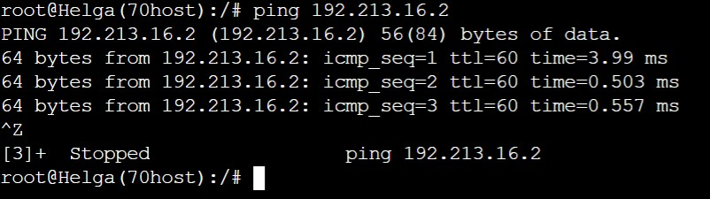

#### Ping dari Helga ke Matt Cugat (192.213.74.2)
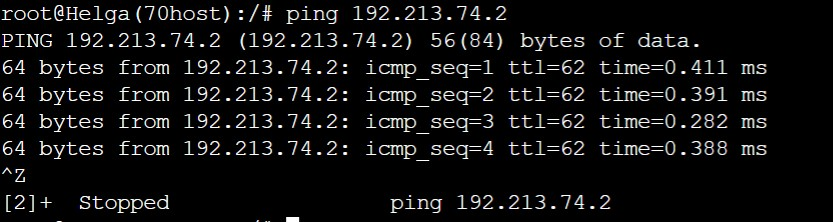

#### Ping dari Johan ke The Beast (192.213.100.2)
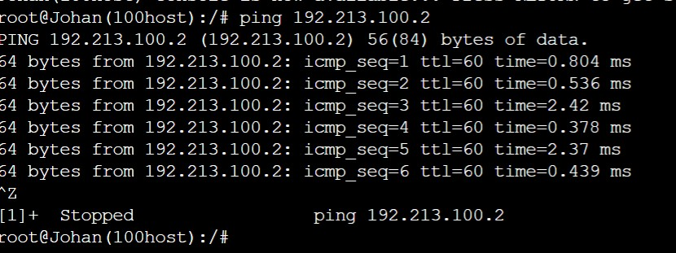

#### Ping dari Guideau ke Johan (192.213.0.2)
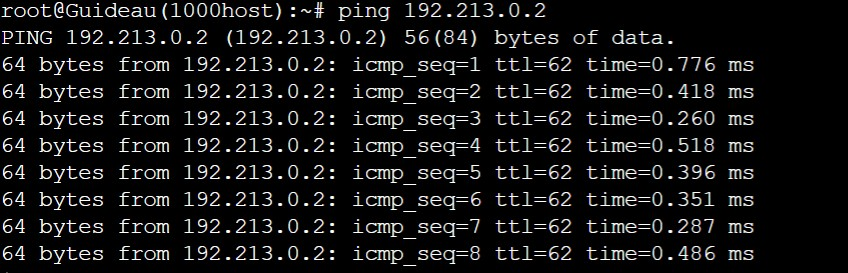

#### Ping dari The Witch ke Helga (192.213.72.130)
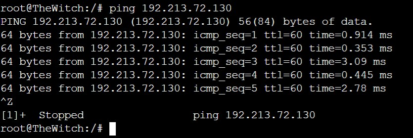

#### Ping dari The Resonance ke The Order (192.213.32.3)
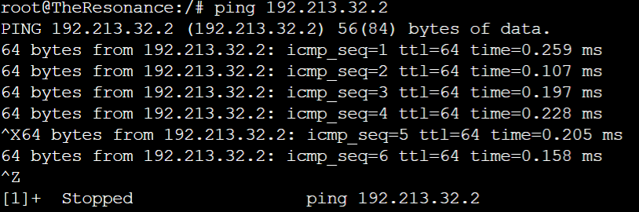

#### Ping dari The Order ke Phanora (192.213.0.3)
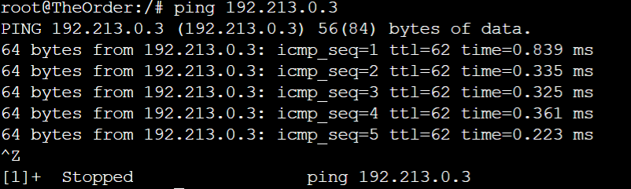

#### Ping dari Phanora ke Spendrow (192.213.72.2)
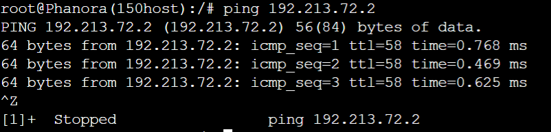

## Kendala Pengerjaan
- Sempat kesulitan untuk menentukan path ip nexthop 
